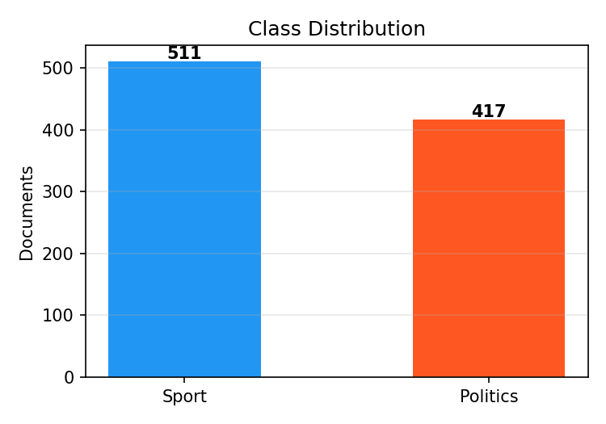
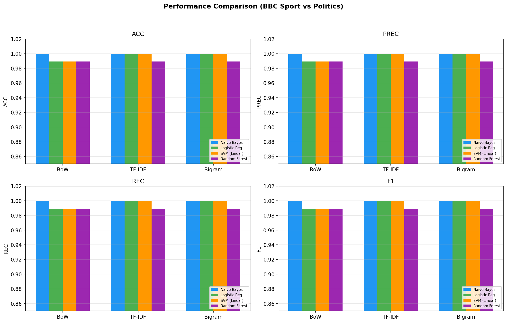
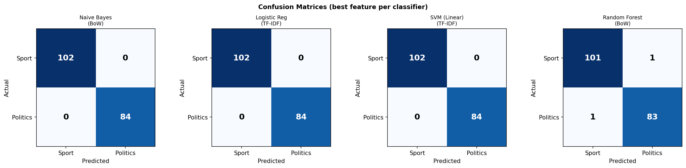
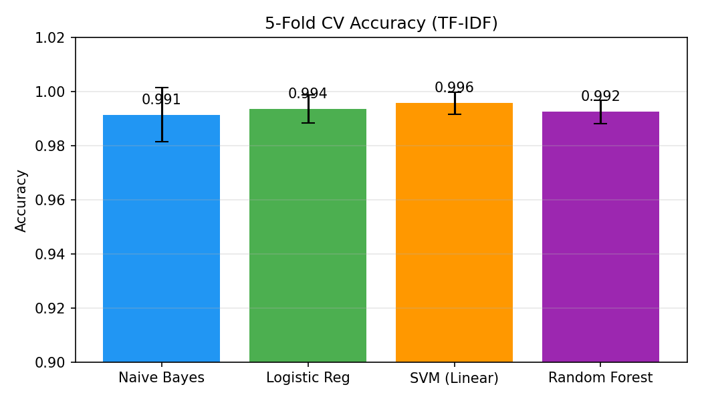

# Sports vs Politics Text Classification

**CSL 7640: Natural Language Understanding — Assignment 1, Problem 4**  
**Roll Number:** b22ch045

## Overview

A binary text classifier that categorizes news articles as **Sport** or **Politics** using classical machine learning techniques. We compare four classifiers across three feature representations, totalling 12 experimental configurations.

## Dataset

**BBC News Full-Text Dataset**  
- **Source:** [http://mlg.ucd.ie/datasets/bbc.html](http://mlg.ucd.ie/datasets/bbc.html)  
- **Reference:** Greene, D. & Cunningham, P. (2006). *Practical Solutions to the Problem of Diagonal Dominance in Kernel Document Clustering.* Proc. ICML 2006.  
- **Size:** 928 documents (511 Sport + 417 Politics), filtered from the full 2225-article dataset  
- **Period:** BBC News articles from 2004–2005

The script automatically downloads and extracts the dataset on first run.

### Dataset Statistics

| Metric | Value |
|---|---|
| Total documents | 928 |
| Sport | 511 (55.1%) |
| Politics | 417 (44.9%) |
| Avg document length | 385 words |
| Vocabulary size | 31,240 tokens |

### Class Distribution



### Top Words per Class


## Feature Representations

| Feature | Description |
|---|---|
| **Bag of Words (BoW)** | Raw word count vectors with stop-word removal (max 10,000 features) |
| **TF-IDF** | Term frequency–inverse document frequency weighting (max 10,000 features) |
| **Bigram TF-IDF** | Unigrams + bigrams with TF-IDF weighting (max 15,000 features) |

## ML Techniques

| Classifier | Description |
|---|---|
| **Multinomial Naive Bayes** | Generative probabilistic model with Laplace smoothing (alpha=1.0) |
| **Logistic Regression** | Discriminative linear model with L2 regularization (C=1.0) |
| **SVM (Linear)** | Maximum-margin linear classifier (C=1.0) |
| **Random Forest** | Ensemble of 200 decision trees |

## Results

### Test Set Performance (80/20 Stratified Split)

| Configuration | Accuracy | Precision | Recall | F1-Score |
|---|---|---|---|---|
| BoW + Naive Bayes | **1.0000** | **1.0000** | **1.0000** | **1.0000** |
| BoW + Logistic Regression | 0.9892 | 0.9895 | 0.9892 | 0.9892 |
| BoW + SVM (Linear) | 0.9892 | 0.9895 | 0.9892 | 0.9892 |
| BoW + Random Forest | 0.9892 | 0.9892 | 0.9892 | 0.9892 |
| TF-IDF + Naive Bayes | **1.0000** | **1.0000** | **1.0000** | **1.0000** |
| TF-IDF + Logistic Regression | **1.0000** | **1.0000** | **1.0000** | **1.0000** |
| TF-IDF + SVM (Linear) | **1.0000** | **1.0000** | **1.0000** | **1.0000** |
| TF-IDF + Random Forest | 0.9892 | 0.9892 | 0.9892 | 0.9892 |
| Bigram + Naive Bayes | **1.0000** | **1.0000** | **1.0000** | **1.0000** |
| Bigram + Logistic Regression | **1.0000** | **1.0000** | **1.0000** | **1.0000** |
| Bigram + SVM (Linear) | **1.0000** | **1.0000** | **1.0000** | **1.0000** |
| Bigram + Random Forest | 0.9892 | 0.9892 | 0.9892 | 0.9892 |

### Performance Comparison



### Confusion Matrices



### 5-Fold Cross-Validation (TF-IDF)

| Classifier | Mean Accuracy | Std |
|---|---|---|
| Naive Bayes | 0.9914 | 0.0100 |
| Logistic Regression | 0.9935 | 0.0053 |
| **SVM (Linear)** | **0.9957** | **0.0040** |
| Random Forest | 0.9925 | 0.0043 |



## Limitations

1. **Dataset size and era:** ~930 articles from 2004–05 may not reflect modern language patterns.
2. **Binary scope:** Borderline articles (e.g., government sports funding) are not modelled.
3. **Feature limitations:** BoW/TF-IDF discard word order and semantics; embeddings or transformers would handle ambiguity better.
4. **English only:** Multilingual or code-switched text is unsupported.
5. **No deep learning:** CNNs, LSTMs, or Transformer models could generalise better.
6. **Minimal preprocessing:** Stemming, lemmatisation, and sub-word tokenisation are not used.

## How to Run

```bash
# install dependencies
pip install scikit-learn matplotlib numpy

# run the classifier
python b22ch045_prob4.py
```

The script will automatically download the BBC dataset on first run, train all models, print results, and save visualisation charts.

## Files

| File | Description |
|---|---|
| `b22ch045_prob4.py` | Main classifier code |
| `b22ch045_prob4.pdf` | Detailed 7-page report |
| `images/` | Visualisation charts |

## References

1. Greene, D. & Cunningham, P. (2006). *Practical Solutions to the Problem of Diagonal Dominance in Kernel Document Clustering.* Proc. ICML 2006.
2. Manning, C. D. et al. (2008). *Introduction to Information Retrieval.* Cambridge University Press.
3. Pedregosa, F. et al. (2011). *Scikit-learn: Machine Learning in Python.* JMLR 12.
4. BBC News Dataset: [http://mlg.ucd.ie/datasets/bbc.html](http://mlg.ucd.ie/datasets/bbc.html)

